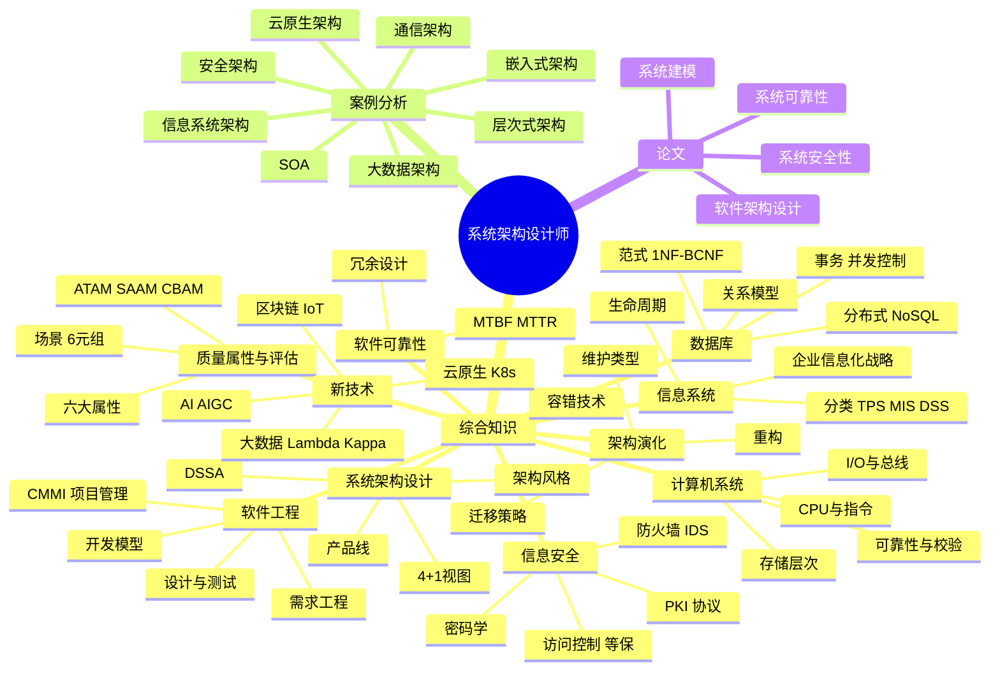

# 系统架构设计师 · 整体知识地图



## 备考优先级矩阵

```mermaid
quadrantChart
    title 考点优先级矩阵
    x-axis "易" --> "难"
    y-axis "低频" --> "高频"
    quadrant-1 "重点攻克"
    quadrant-2 "优先拿分"
    quadrant-3 "战略放弃"
    quadrant-4 "理解即可"
    "架构风格": [0.3, 0.9]
    "质量属性 ATAM": [0.6, 0.95]
    "数据库范式": [0.4, 0.85]
    "设计模式": [0.4, 0.7]
    "UML图": [0.3, 0.7]
    "云原生": [0.6, 0.85]
    "区块链": [0.7, 0.5]
    "嵌入式": [0.8, 0.4]
    "软件可靠性": [0.5, 0.75]
    "论文写作": [0.8, 1.0]
```
