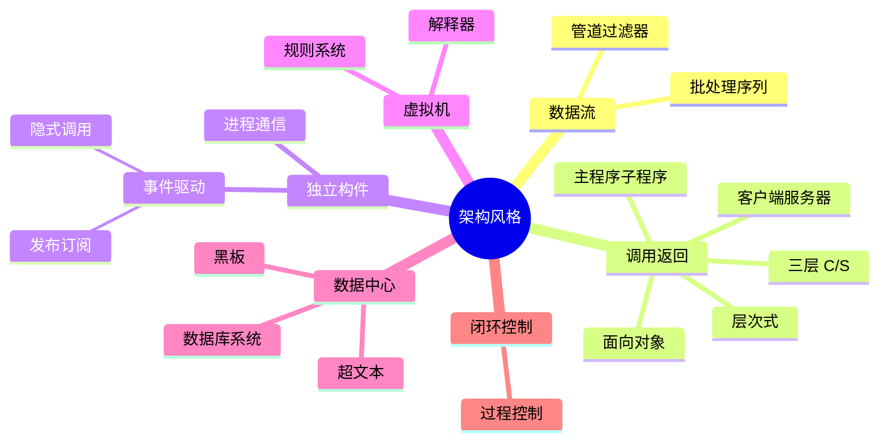
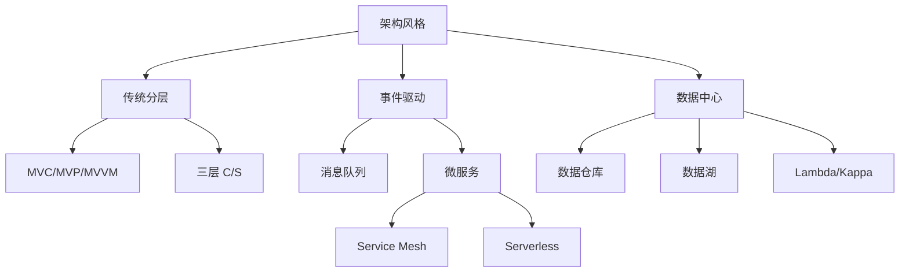

# 架构风格脑图

```mermaid
mindmap
  root((架构风格))
    数据流
      批处理序列
      管道过滤器
    调用返回
      主程序子程序
      面向对象
      层次式
      客户端服务器
      三层 C/S
    独立构件
      进程通信
      事件驱动
        隐式调用
        发布订阅
    虚拟机
      解释器
      规则系统
    数据中心
      数据库系统
      超文本
      黑板
    闭环控制
      过程控制
```

## 衍生现代架构

```mermaid
graph TD
    A[架构风格] --> B[传统分层]
    A --> C[事件驱动]
    A --> D[数据中心]
    B --> B1[MVC/MVP/MVVM]
    B --> B2[三层 C/S]
    C --> C1[消息队列]
    C --> C2[微服务]
    C2 --> C3[Service Mesh]
    C2 --> C4[Serverless]
    D --> D1[数据仓库]
    D --> D2[数据湖]
    D --> D3[Lambda/Kappa]
```
