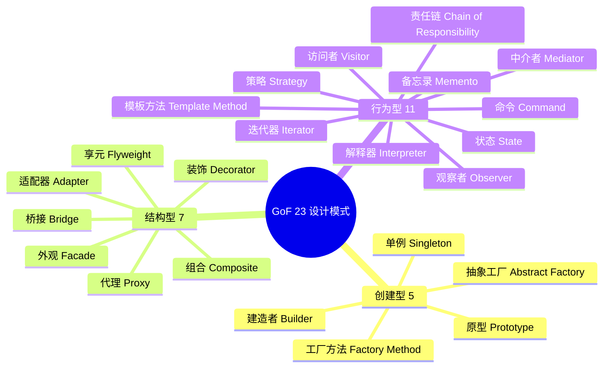

# GoF 23 设计模式脑图

```mermaid
mindmap
  root((GoF 23 设计模式))
    创建型 5
      单例 Singleton
      工厂方法 Factory Method
      抽象工厂 Abstract Factory
      建造者 Builder
      原型 Prototype
    结构型 7
      适配器 Adapter
      桥接 Bridge
      组合 Composite
      装饰 Decorator
      外观 Facade
      享元 Flyweight
      代理 Proxy
    行为型 11
      责任链 Chain of Responsibility
      命令 Command
      解释器 Interpreter
      迭代器 Iterator
      中介者 Mediator
      备忘录 Memento
      观察者 Observer
      状态 State
      策略 Strategy
      模板方法 Template Method
      访问者 Visitor
```
