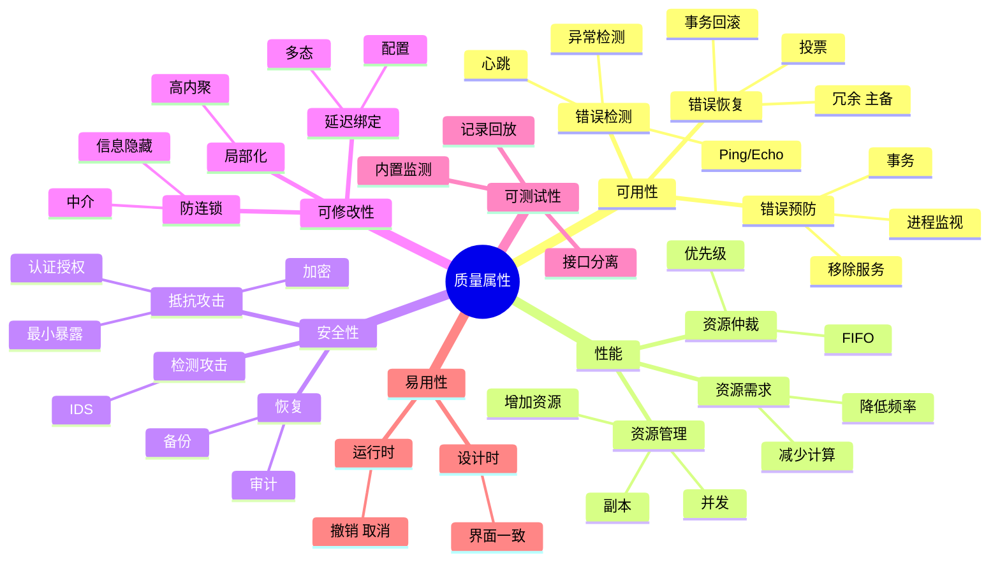

# 质量属性与战术脑图

```mermaid
mindmap
  root((质量属性))
    可用性
      错误检测
        Ping/Echo
        心跳
        异常检测
      错误恢复
        冗余 主备
        投票
        事务回滚
      错误预防
        移除服务
        事务
        进程监视
    性能
      资源需求
        减少计算
        降低频率
      资源管理
        并发
        增加资源
        副本
      资源仲裁
        FIFO
        优先级
    安全性
      抵抗攻击
        认证授权
        加密
        最小暴露
      检测攻击
        IDS
      恢复
        审计
        备份
    可修改性
      局部化
        高内聚
      防连锁
        信息隐藏
        中介
      延迟绑定
        配置
        多态
    可测试性
      记录回放
      内置监测
      接口分离
    易用性
      设计时
        界面一致
      运行时
        撤销 取消
```

## 场景 6 元组

```mermaid
graph LR
    A[刺激源] --> B[刺激]
    B --> C[制品]
    C --> D[环境]
    D --> E[响应]
    E --> F[响应度量]
```
