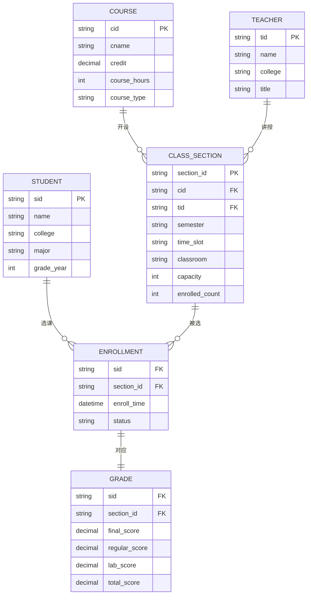
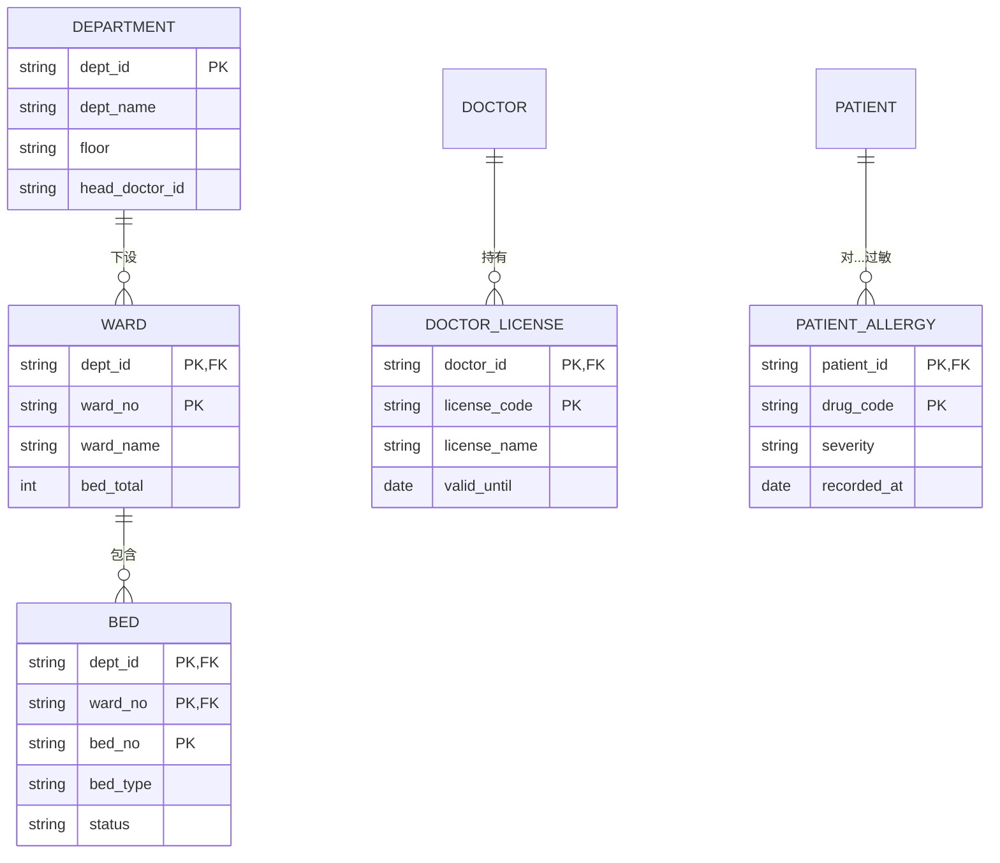

# 案例题型 02 · 数据库设计（ER + 规范化）

> **必考题型**，几乎每年 1 题，25 分。

## 考点分布

- 补全 **ER 图**（实体、属性、联系、基数）
- 转换 ER → **关系模式**
- 判定**范式**（1NF / 2NF / 3NF / BCNF）
- 识别**函数依赖 / 候选键 / 主键 / 外键**
- 参照完整性、并发控制、分布式数据库

## 核心理论（必背）

### 函数依赖

- **部分依赖**：X → Y，但存在 X 的真子集 X' 也能 → Y → 违反 2NF
- **传递依赖**：X → Y → Z，违反 3NF
- **平凡依赖**：Y ⊆ X 时 X → Y（可忽略）

### 范式

| 范式 | 要求 | 常见违规 |
|---|---|---|
| **1NF** | 属性**原子**（不可再分） | 一列存多值 |
| **2NF** | 1NF + **消除部分依赖**（非主属性完全依赖候选键） | 联合主键中只依赖一部分 |
| **3NF** | 2NF + **消除传递依赖** | 非主属性依赖非主属性 |
| **BCNF** | 3NF + **所有决定因素都是候选键** | 主属性对主属性的部分依赖 |

### ER 图联系类型

- **一对一（1:1）**
- **一对多（1:N）**
- **多对多（M:N）**（需引入**联系表**）

### 基数（Cardinality）

- 最小 / 最大基数，如 (0,1)、(1,N)

## 答题模板

### 问题 1：补全 ER 图

**套路**：
1. 找题干中名词 → 实体
2. 找动词短语 → 联系
3. 属性分到实体内
4. **弱实体**用双框，**多值属性**用双椭圆

### 问题 2：ER → 关系模式

**套路**：
- **1:1**：合入任一方（选被依赖方）
- **1:N**：N 端加外键指向 1 端
- **M:N**：**独立一张联系表**（主键 = 双方主键组合）

**标注**：关系模式写为 `学生（学号, 姓名, 系号）`，主键加粗 / 加下划线。

### 问题 3：判范式 + 分解

**套路**：
```
(1) 列函数依赖集 F
(2) 求候选键（闭包算法）
(3) 判范式：
    - 有非原子属性 → 1NF
    - 有部分依赖 → 2NF 冲突
    - 有传递依赖 → 3NF 冲突
(4) 分解：
    - 保持依赖、无损连接
    - 每个子模式都是 3NF 或 BCNF
```

### 问题 4：参照完整性

**套路**（触发器或约束）：
- **插入**子表 → 要求父表有对应键
- **删除 / 更新**父表 → 级联（CASCADE）、置空（SET NULL）、拒绝（RESTRICT）

## 万能高分句

- "学生与课程之间是 **多对多** 联系，需引入**选课**联系表，主键为 **(学号, 课号)** 组合"
- "当前模式存在**传递依赖**：`学号→系号→系主任`，违反 **3NF**，应分解为 **学生(学号,姓名,系号)** 和 **系(系号,系主任)**"
- "为保证**参照完整性**，在子表的外键上定义 **ON DELETE CASCADE**，父记录删除时联动清理"

## 并发与分布式加分点

### 并发控制

- **悲观锁**（`SELECT ... FOR UPDATE`）vs **乐观锁**（版本号 / 时间戳）
- **隔离级别**：读未提交 / 读已提交 / 可重复读 / 串行化
- **问题**：脏读 / 不可重复读 / 幻读 / 丢失更新

### 分布式数据库

- **分片**：水平分片（按范围 / 哈希）/ 垂直分片
- **复制**：主从 / 多主
- **CAP / BASE**
- **两阶段提交 2PC** / **三阶段 3PC**

## 常见陷阱

| ❌ | ✅ |
|---|---|
| M:N 联系不建表 | **必须**独立表 |
| 联系表主键只用一个 | 主键 = **双方主键组合** |
| 分解只说结果不给函数依赖 | 必须**列出 F** 再推 |
| 不说保持依赖 / 无损连接 | **两个性质**必须明确 |
| 外键方向错 | **多方**指向**一方** |

---

## 模拟案例题

> ⚠️ **自主命题**：题干场景为基于公开考点改编的虚构案例，避免版权风险；技术参数贴合真实工程实践。建议先**严格 25 分钟限时**作答，再对照参考答案。

### 模拟题 1 · 在线教育选课系统 ER + 3NF 分解（25 分）

**【题干】**（约 820 字）

某高校"智慧学堂"在线教育平台为全校 **5.2 万名本科生 + 1.8 万名研究生**提供选课、上课、作业、成绩管理一站式服务。项目由信息化办公室主导，组建 **18 人**团队（DBA 2 人、后端 8 人、前端 4 人、测试 3 人、PM 1 人），开发周期 **8 个月**，2025 年春季学期上线。

业务关键指标：每学期开放课程 **6000 门**（含通识、专业、实验、体育），选课开放期 24 小时内峰值 **QPS 1.2 万**（学生抢热门课），系统单日峰值访问 **200 万次**，选课接口 **P95 < 300ms**，年可用性 **99.95%**。

DBA 张工根据需求梳理出业务规则如下：

1. **学生**信息含学号（唯一）、姓名、学院、专业、年级、入学年份、联系方式（手机号、邮箱）；
2. **教师**含工号（唯一）、姓名、所在学院、职称、研究方向；
3. **课程**含课程号、课程名、学分、学时、课程类型（通识/专业/实验/体育）、开课学期；同一门课程**每学期可由多位教师**分别开多个**教学班**（如"高等数学"在 2025 春有 8 个班，分别由不同老师上课）；
4. **教学班**含教学班号（唯一）、上课时间段（一周内多个时段，如周一 1-2 节、周三 3-4 节）、上课地点（教室）、容量上限（如 60 人）、当前选课人数；
5. **学生选课**：一名学生在一个学期可选多个教学班，一个教学班有多名学生；选课时需记录**选课时间**、**选课状态**（已选/退课/已完成）；
6. **成绩**：学生选完一个教学班后，每学期末由教师录入**期末成绩**（百分制）、**平时成绩**、**实验成绩**（仅实验类课程），系统按权重自动计算**总评成绩**；
7. **选课规则约束**：先修课程不达标禁止选课、同一时段不能选两门、教学班选满拒绝；
8. 数据库选用 **MySQL 8.0**，订单库一主两从半同步复制；选课表预估**单学期数据量 60 万行**，三年积累 **360 万行**。

张工初步给出实体关系草图，但其中 ER 图存在缺漏，且部分关系模式未达到 3NF，需对方案进行规范化分析。

**【小问】**（合计 25 分）

**问 1**（8 分）：用 Mermaid `erDiagram` 补全该业务的 ER 图，至少包含 **学生、教师、课程、教学班、选课、成绩** 六类实体或联系；标注每个联系的**基数**（1:1 / 1:N / M:N），并说明 **"教学班"** 为什么应建模为**独立实体**而非 "课程-教师" 之间的简单 M:N 联系。

**问 2**（10 分）：给定如下原始关系模式 `R(学号, 姓名, 学院, 专业, 教学班号, 课程号, 课程名, 学分, 教师工号, 教师姓名, 期末成绩, 平时成绩)`，函数依赖集 F 包含：① 学号→姓名,学院,专业 ② 课程号→课程名,学分 ③ 教学班号→课程号,教师工号 ④ 教师工号→教师姓名 ⑤ 学号,教学班号→期末成绩,平时成绩。  
（1）求 R 的**候选键**并写出推导过程（4 分）；（2）判断 R 属于第几范式并说明理由（2 分）；（3）将 R **无损连接且保持函数依赖地分解**为 3NF（4 分）。

**问 3**（7 分）：选课开放第一分钟约有 **8000 名学生**同时抢"高等数学（王老师班）"这门容量 60 的教学班。请设计**并发控制方案**，说明（1）数据库层面如何避免超选（如使用何种锁、SQL 写法）（4 分）；（2）相比"乐观锁 + 重试"和"悲观锁 + Redis 预扣减"两种方案的优缺点对比（3 分）。

---

**【参考答案】**

**问 1**：ER 图补全 + 教学班建模理由（约 280 字）



基数：STUDENT-ENROLLMENT (1:N)、CLASS_SECTION-ENROLLMENT (1:N)、COURSE-CLASS_SECTION (1:N)、TEACHER-CLASS_SECTION (1:N)、ENROLLMENT-GRADE (1:1)。

**为什么"教学班"必须独立建实体**：① 教学班具备**自身属性**（容量、时间段、教室、当前人数），是 ER 中的**弱实体到独立实体演变**的典型；② 同一课程同一教师在不同学期可开多个班，**纯 M:N 联系无法承载这些非键属性**；③ 学生的选课对象是"教学班"而非"课程"或"教师"，业务主键是 section_id；④ 若强行用"课程-教师"M:N，时间段、教室冲突检测无法在数据库层表达，违反**避免多值属性入主表**原则。

**问 2**：候选键 + 范式判定 + 3NF 分解（约 320 字）

（1）**候选键推导**：从 F 出发，{学号, 教学班号} 闭包：  
{学号, 教学班号} → 姓名,学院,专业（依赖①）→ 课程号,教师工号（依赖③）→ 课程名,学分（依赖②）→ 教师姓名（依赖④）→ 期末成绩,平时成绩（依赖⑤），覆盖全属性。故**候选键 = {学号, 教学班号}**，唯一。

（2）**范式判定**：R 属于 **1NF**。理由：存在**部分函数依赖**——非主属性"姓名/学院/专业"仅依赖候选键的真子集"学号"（依赖①），违反 2NF；同时存在**传递依赖**——课程号→课程名（先经教学班号→课程号→课程名），违反 3NF。故未达 2NF。

（3）**保持依赖且无损连接的 3NF 分解**：

| 关系 | 属性 | 主键 | 来源依赖 |
|---|---|---|---|
| R1 学生 | (学号, 姓名, 学院, 专业) | 学号 | ① |
| R2 课程 | (课程号, 课程名, 学分) | 课程号 | ② |
| R3 教师 | (教师工号, 教师姓名) | 教师工号 | ④ |
| R4 教学班 | (教学班号, 课程号, 教师工号) | 教学班号 | ③ |
| R5 选课成绩 | (学号, 教学班号, 期末成绩, 平时成绩) | (学号, 教学班号) | ⑤ |

**验证**：① **保持依赖**——F 中 5 条依赖分别在 R1/R2/R3/R4/R5 中保留；② **无损连接**——R4 与 R5 通过 教学班号 公共属性可还原原表，R1/R2/R3 通过 R4/R5 外键关联，符合 chase test。

**问 3**：抢课并发控制方案（约 220 字）

（1）**数据库层方案**：在教学班表使用**带条件 UPDATE + 行锁**实现"先扣容量再插入选课记录"：

```sql
START TRANSACTION;
UPDATE class_section 
   SET enrolled_count = enrolled_count + 1
 WHERE section_id = ? AND enrolled_count < capacity;
-- 受影响行数 = 0 → 容量已满，回滚
INSERT INTO enrollment(sid, section_id, enroll_time, status) VALUES (?, ?, NOW(), '已选');
COMMIT;
```

InnoDB 在 UPDATE 时获取**行级排他锁（X 锁）**，且 `enrolled_count < capacity` 条件由数据库原子判定，**杜绝超选**。

（2）**方案对比**：

| 方案 | 优点 | 缺点 | 适用 |
|---|---|---|---|
| **乐观锁（version 字段）+ 重试** | 无锁、并发高 | 8000 人抢 60 名额 → 99% 失败重试，**雪崩风险** | 冲突低场景 |
| **悲观锁（SELECT ... FOR UPDATE）** | 强一致、不丢请求 | 行锁排队，P95 可能 > 300ms 不达标 | 中等并发 |
| **Redis 预扣减 + 异步落库** | **QPS 1.2 万可扛**、亚毫秒响应 | 一致性弱、需对账补偿 | **本场景推荐**：Redis Lua 原子扣减容量，扣减成功后投递 RocketMQ 异步写 MySQL |

---

**【评分要点】**

| 得分项 | 分值 | 关键词/要求 |
|---|---|---|
| ER 图含 6 类实体/联系 | 4 分 | 缺一扣 0.5 分 |
| 基数标注完整 | 2 分 | 1:1 / 1:N / M:N 写错扣 1 分 |
| 教学班独立实体理由 | 2 分 | 必须提"非键属性 / 弱实体" |
| 候选键推导完整 | 4 分 | 没写闭包推导扣 2 分 |
| 范式判定+理由 | 2 分 | 必须指出"部分依赖 / 传递依赖" |
| 3NF 分解 5 张表 | 3 分 | 缺一张表扣 1 分 |
| 保持依赖 + 无损连接验证 | 1 分 | 没说"两个性质"扣 1 分 |
| 并发控制 SQL 完整 | 4 分 | 没用 `enrolled_count < capacity` 条件扣 2 分 |
| 三方案对比含量化 | 3 分 | 没量化（如 99% 重试失败）扣 1 分 |

**常见扣分点**：
- ❌ ER 图把"教学班"省略为 课程-教师 M:N 联系——丢失 capacity/time_slot 关键属性
- ❌ 候选键直接写 {学号, 教学班号} 不给闭包推导——视为猜答案
- ❌ 3NF 分解后把成绩表主键写为单列学号——必须 (学号, 教学班号) 复合主键
- ❌ 并发方案只说"加锁"不写具体 SQL——必须给可执行 SQL

**高分技巧**：
- 用 Mermaid `erDiagram` 渲染 ER 图，比手绘表格更专业，PDF 导出仍可读
- 对比方案时附上**实际 QPS 与容量比**（"8000 抢 60 = 133:1"），论证方案选择的工程合理性

---

### 模拟题 2 · 医院 HIS 弱实体 + 多值属性建模（25 分）

**【题干】**（约 780 字）

某三甲综合医院"康宁医院"启动新一代 **HIS（医院信息系统）** 改造，整合现有的门诊挂号、住院、处方、检查、检验、电子病历共 6 大子系统。项目由信息科牵头，外包给厂商 A 团队 **22 人**联合开发，建设周期 **14 个月**，2026 年中投产。医院日均门诊量 **8000 人次**、住院床位 **1200 张**、月处方量 **24 万张**。

DBA 团队梳理需要建模的核心业务对象：

1. **科室**（department_id 全院唯一）：含科室名、所在楼层、负责人、电话；下设**病区**——一个科室可有多个病区，**病区编号在科室内部唯一**（如"心内科 - 1 病区"、"心内科 - 2 病区"）；
2. **医生**（doctor_id 唯一）：姓名、性别、职称、所属科室、**多个执业资格证**（一名医生可拥有"主任医师证 + 介入资格证 + 麻醉资格证"等 1-5 个不等）；
3. **患者**（patient_id 全院唯一）：姓名、性别、出生日期、身份证号、**多个联系方式**（手机、座机、紧急联系人手机），**多个过敏药物**（青霉素、磺胺、链霉素等，可为空）；
4. **床位**：床位号在病区内部唯一（不跨病区），含床位类型（普通/重症/隔离）、当前状态（空闲/占用/维护）；
5. **住院**：一名患者一次住院记录含住院号（系统全局唯一）、入院日期、出院日期、主治医生、所在床位、诊断编码（ICD-10）；
6. **检查项目**：CT、MRI、心电图等，每项有标准价格；患者每次住院期间可做**多项检查**，每项检查记录执行时间、执行医生、检查结果文本；
7. **处方**：处方号、开方医生、患者、开方时间，**一张处方含 1-N 种药品**，每种药品标注剂量、用法、用量、天数；
8. 数据库平台为 **达梦 DM8**（信创要求），日活跃连接数预估 **1500**，热数据保留 5 年。

DBA 注意到几个建模难点：病区不能脱离科室存在、医生执业资格是多值、处方-药品是 M:N 携带属性。请基于 ER 模型规范化建模。

**【小问】**（合计 25 分）

**问 1**（8 分）：用 Mermaid `erDiagram` 给出**病区**、**床位**、**医生执业资格**、**患者过敏药物**四个建模点的处理方案。其中：（1）说明哪些是**弱实体**及其判定依据（3 分）；（2）将"医生的多个执业资格证"和"患者的多个过敏药物"两个**多值属性**消除为独立实体（5 分）。

**问 2**（10 分）：原始关系模式 `处方明细(处方号, 开方医生工号, 医生姓名, 患者ID, 患者姓名, 开方时间, 药品编码, 药品名称, 规格, 单价, 剂量, 用法, 用量, 天数)`，函数依赖集 F：① 处方号→开方医生工号,患者ID,开方时间 ② 医生工号→医生姓名 ③ 患者ID→患者姓名 ④ 药品编码→药品名称,规格,单价 ⑤ 处方号,药品编码→剂量,用法,用量,天数。  
（1）求候选键（3 分）；（2）该模式属于第几范式（2 分）；（3）分解到 **BCNF**，给出关系列表并验证保持依赖性（5 分）。

**问 3**（7 分）：HIS 数据要求**审计追溯 10 年**且符合**等保三级**与**电子病历应用水平 5 级**。设计住院记录表与处方表的（1）**逻辑删除 + 历史归档**策略（4 分）；（2）**敏感字段加密**与**审计日志**方案（3 分）。

---

**【参考答案】**

**问 1**：弱实体 + 多值属性建模（约 320 字）



**弱实体判定**（3 分）：
- **WARD（病区）是弱实体**：① 病区编号 ward_no **仅在 dept_id 内部唯一**（不全局唯一）；② 病区**依赖科室存在**（科室撤并则病区随之消失）；③ 主键必须是 (dept_id, ward_no) 复合键。
- **BED（床位）是双重弱实体**：依赖于 WARD，主键为 (dept_id, ward_no, bed_no)。

**多值属性消除**（5 分）：
- 医生执业资格 → 独立实体 `DOCTOR_LICENSE`，主键 (doctor_id, license_code)，1:N 关联 DOCTOR；这样可承载"证书有效期 valid_until"等扩展属性。
- 患者过敏药物 → 独立实体 `PATIENT_ALLERGY`，主键 (patient_id, drug_code)，记录过敏严重程度、登记时间。**禁止**在 PATIENT 表中用 "allergy_drugs VARCHAR(500)" 逗号分隔——违反 1NF 原子性，无法做"过敏患者统计"等查询。

**问 2**：候选键 + BCNF 分解（约 350 字）

（1）**候选键**：{处方号, 药品编码} 的闭包覆盖全属性（处方号→医生工号→医生姓名；处方号→患者ID→患者姓名；药品编码→药品名称,规格,单价；处方号,药品编码→剂量,用法,用量,天数；处方号→开方时间）。**候选键 = {处方号, 药品编码}**，唯一。

（2）**范式判定**：属于 **1NF**。理由：① 非主属性"医生姓名 / 患者姓名"对候选键存在**部分依赖**（仅依赖处方号一部分）→ 违反 2NF；② 同时"医生姓名"通过"医生工号"传递依赖于候选键 → 违反 3NF；③ 依赖②④的左部不是超键 → 违反 BCNF。

（3）**BCNF 分解**：

| 关系 | 属性 | 主键 |
|---|---|---|
| R1 处方主表 | (处方号, 开方医生工号, 患者ID, 开方时间) | 处方号 |
| R2 医生 | (医生工号, 医生姓名) | 医生工号 |
| R3 患者 | (患者ID, 患者姓名) | 患者ID |
| R4 药品 | (药品编码, 药品名称, 规格, 单价) | 药品编码 |
| R5 处方明细 | (处方号, 药品编码, 剂量, 用法, 用量, 天数) | (处方号, 药品编码) |

**保持依赖性验证**：
- F 中依赖① → R1 全部保留；
- 依赖② → R2 保留；依赖③ → R3 保留；依赖④ → R4 保留；依赖⑤ → R5 保留；
- 5 条依赖**全部保持**，且每个分解关系左部都是超键，**满足 BCNF**。
- **无损连接**：R1 与 R5 通过"处方号"等值连接可还原原表，R2/R3/R4 通过外键链接 R1/R5。

**问 3**：审计与加密方案（约 220 字）

（1）**逻辑删除 + 历史归档**：
- 主表加 `is_deleted TINYINT DEFAULT 0`、`deleted_at DATETIME NULL`、`deleted_by VARCHAR(32)`，**禁止物理 DELETE**；查询统一加 `WHERE is_deleted = 0`。
- 历史归档：**冷热分离**——热数据 1 年保留主库（DM8 主从），1-3 年迁入归档库（DM8 归档实例），3-10 年下沉到对象存储（如华为 OBS）+ 全文索引（ElasticSearch）。
- 归档触发：每月凌晨定时任务按 admission_date 切分；归档前**校验 SHA-256 摘要**保证未被篡改。

（2）**加密 + 审计**：
- **敏感字段加密**：身份证号、手机号、过敏信息、诊断 ICD-10 用**国密 SM4** 字段级加密落库，密钥托管 KMS（HSM 硬件加密机）；查询时按需解密，**禁止 SELECT \* 全字段返回**。
- **审计日志**：`audit_log` 表记录每次 INSERT/UPDATE/DELETE 的（操作人、时间、表名、主键、变更前后值 JSON、IP），**应用层 + 数据库触发器双层落库**；日志表只追加（INSERT-only）、独立账号、独立备份。

---

**【评分要点】**

| 得分项 | 分值 | 关键词/要求 |
|---|---|---|
| 病区/床位识别为弱实体 | 3 分 | 必须说"复合主键"和"依赖父实体" |
| 多值属性建模为独立表 | 5 分 | 必须列出主键含父实体外键 |
| BCNF 候选键推导 | 3 分 | 缺闭包推导扣 1 分 |
| 范式判定（1NF）含理由 | 2 分 | 没说"部分/传递依赖"扣 1 分 |
| BCNF 5 张表分解 | 4 分 | 缺一张扣 1 分 |
| 保持依赖性论证 | 1 分 | 必须逐条对应 |
| 逻辑删除字段设计 | 2 分 | is_deleted + deleted_at 双字段 |
| 冷热归档策略 | 2 分 | 必含**对象存储**或**独立归档库** |
| SM4 字段级加密 | 2 分 | 没说密钥托管扣 1 分 |
| 审计日志机制 | 1 分 | 必须 INSERT-only |

**常见扣分点**：
- ❌ 把医生执业资格写成"licenses VARCHAR(200)"——违反 1NF 原子性
- ❌ 病区主键写成 ward_id 全局唯一——错失"弱实体"考点
- ❌ BCNF 分解后只剩 4 张表把医生/患者合并——破坏依赖②③
- ❌ 加密只写"AES"不写"SM4 + 信创合规"——医院系统必须国密

**高分技巧**：
- 提到"电子病历应用水平 5 级"等行业合规标准（HIS 必考点），体现领域专业度
- 论证归档时结合**审计追溯 10 年**与"等保三级"双重要求，给出冷热三层方案

---

### 模拟题 3 · 跨境电商订单分布式分片设计（25 分）

**【题干】**（约 800 字）

某跨境电商平台"环球购"在 2024 年完成 B 轮融资后高速扩张，业务覆盖**东南亚 6 国 + 中东 4 国**，注册用户 **6800 万**，DAU **520 万**，**日订单量 380 万笔**（大促峰值 **1100 万笔**），订单服务团队 **35 人**，2025 年 Q2 启动订单库分库分表改造，目标支撑 **3 年内日订单 2000 万**。

原有订单系统现状：

1. **单库单表 MySQL 8.0**（一主两从），订单表 `t_order` 已积累 **18 亿行**、**单表 1.4TB**，B+树高度 5 层，索引深度过深导致查询 **P95 > 1.2 秒**；
2. 业务查询模式分布：① 按 user_id 查"我的订单列表" **占 65%** ② 按 order_no 查订单详情 **占 25%** ③ 按 merchant_id 查"商家订单" **占 8%** ④ 跨维度报表 BI 查询 **占 2%**；
3. 跨国订单需按**用户所在国家**做**数据驻留合规**（如沙特数据不能出境）；
4. 订单表关键字段：order_no（19 位雪花 ID）、user_id、merchant_id、country_code、product_id、price、status、create_time；
5. 订单生命周期 90 天后变只读，1 年后归档；活跃数据约占 12%；
6. 系统使用 ShardingSphere 5.x 作为分片中间件，已与 RocketMQ、Seata 集成。

架构师林工设计了"**两级分片：按 country_code 国家分库 + 按 user_id 哈希分表**"方案，但 DBA 反对，认为：① 商家维度查询会全表扫描；② country_code 倾斜严重（印尼+泰国占 78% 流量）；③ 跨库分布式事务成本高。需重新评估方案。

**【小问】**（合计 25 分）

**问 1**（8 分）：分析林工原方案的（1）**国家分片倾斜**严重程度（用具体数字测算）（3 分）；（2）**user_id 哈希分表**对四类查询模式各自的影响（5 分，按查询占比加权评分）。

**问 2**（10 分）：给出**改进后的分片方案**，需说明：（1）分片键选择与分片算法（4 分）；（2）库数 / 表数取值依据（参照"单表 ≤ 500 万行 / 单库 ≤ 1TB"原则）（3 分）；（3）非主键查询（按 merchant_id、按 order_no）的解决方案（3 分）。

**问 3**（7 分）：（1）大促期间分布式事务方案——TCC、Saga、本地消息表、Seata-AT 四选一并说明理由（4 分）；（2）冷热数据归档与跨境数据合规如何同时满足？（3 分）

---

**【参考答案】**

**问 1**：林工原方案问题分析（约 290 字）

（1）**国家分片倾斜测算**（3 分）：

| 国家 | 流量占比 | 在 10 库均分时实际分配 | 倾斜倍数 |
|---|---|---|---|
| 印尼 | 45% | 1 库承担 45% | **4.5x** |
| 泰国 | 33% | 1 库承担 33% | **3.3x** |
| 越南 | 9% | 1 库承担 9% | 0.9x |
| 其他 7 国 | 13% | 7 库平均 1.86% | 0.19x |

印尼库承担 45% 流量 = **日均 171 万订单**，但只有 1/10 的资源 → **CPU 必爆**。这违反"分片均匀"基本原则，倾斜倍数 4.5x 远超工程可接受的 1.5x 上限。

（2）**user_id 哈希对四类查询的影响**（5 分）：

| 查询模式 | 占比 | 命中分片数 | 影响 | 加权得分 |
|---|---|---|---|---|
| 按 user_id 查列表 | 65% | 1 | ✅ 完美命中 | 65 × 1.0 = 65 |
| 按 order_no 查详情 | 25% | 全部 | ❌ 全分片扫描 | 25 × 0.0 = 0 |
| 按 merchant_id | 8% | 全部 | ❌ 全分片扫描 | 8 × 0.0 = 0 |
| BI 报表 | 2% | 全部 | ⚠️ 走 ES/ClickHouse | 2 × 0.5 = 1 |
| **总分** | | | | **66/100** |

加权得分仅 66/100——**75% 的查询在分片维度上低效**。

**问 2**：改进方案（约 320 字）

（1）**分片键 + 算法**：选择 **user_id 作为唯一分片键**，分片算法采用"**user_id % 库数 → 库号；user_id / 库数 % 表数 → 表号**"两级哈希。理由：① user_id 查询占 65% 主流量，最高频路径必须直达；② user_id 分布天然均匀（雪花 ID）；③ 国家维度通过库内 country_code 字段+索引解决，不上升为分片键。

（2）**库数与表数测算**：
- 3 年订单总量：380 万 × 365 × 3 ≈ **41.6 亿**；活跃 12% ≈ 5 亿（90 天内）。
- 单表上限 500 万：5 亿 / 500 万 = **100 张表**。
- 单库 1TB：每库 5 张表 × 单表 200GB ≈ 1TB → **20 库 × 5 表 = 100 表**。
- 余量保护：实际取 **32 库 × 32 表 = 1024 表**（2^N 便于扩容、留 30% 弹性）。

（3）**非主键查询解决方案**：
- **按 order_no 查**（25%）：order_no 雪花 ID 中**内嵌 user_id 后 N 位**作为分片路由因子（"基因法"），无需建二级索引，直接命中分片；
- **按 merchant_id 查**（8%）：建立**异构索引表**（merchant_id → user_id, order_no），CDC 监听 binlog 实时同步至 ES，商家端走 ES 查询；
- **BI 报表**（2%）：MySQL → Flink CDC → ClickHouse 实时入仓，BI 走 ClickHouse 不打主库。

**问 3**：分布式事务 + 冷热合规（约 220 字）

（1）**分布式事务选型**：选 **本地消息表 + 最终一致**。

| 方案 | 一致性 | 性能 | 复杂度 | 适配本场景 |
|---|---|---|---|---|
| TCC | 强一致 | P95+50ms | 高（每业务写 3 套） | ❌ 大促 1100 万 QPS 扛不住 |
| Seata-AT | 强一致 | P95+30ms | 低 | ❌ 全局锁瓶颈 |
| Saga | 最终一致 | 中 | 中 | ⚠️ 长流程补偿复杂 |
| **本地消息表** | **最终一致** | **P95+10ms** | 低 | ✅ **推荐** |

理由：跨境电商订单允许秒级最终一致；本地消息表借助 RocketMQ 事务消息 + 定时补偿扫描器，**无全局锁、性能影响最小**，与团队现有 RocketMQ 栈契合度高。

（2）**冷热分离 + 跨境合规**：
- **冷热**：90 天内热数据留 MySQL；91-365 天迁 TiDB（可分析）；1 年以上归档 OSS + Hudi 表。
- **跨境合规**：在分片内增加 country_code 维度的**物理隔离**——印尼/泰国数据库部署在新加坡 Region，沙特数据库部署在中东 Region；通过 ShardingSphere 的 **多活路由策略**按 country_code 路由到对应 Region 的库集群，**禁止跨 Region 复制敏感字段**，符合 GDPR 和当地数据驻留法规。

---

**【评分要点】**

| 得分项 | 分值 | 关键词/要求 |
|---|---|---|
| 国家倾斜含具体数字测算 | 3 分 | 没量化扣 2 分 |
| 四类查询加权得分表 | 5 分 | 缺加权概念扣 2 分 |
| 分片键选 user_id 含理由 | 4 分 | 必须扣紧 65% 高频 |
| 库表数测算含工程公式 | 3 分 | 没用 500 万/1TB 原则扣 2 分 |
| order_no 基因法 | 2 分 | 提"基因法/inline routing"加分 |
| 异构索引表 + CDC | 1 分 | 没提 binlog 同步扣 1 分 |
| 4 方案对比表 | 2 分 | 缺量化（如+50ms）扣 1 分 |
| 选本地消息表+理由 | 2 分 | 没提"最终一致"扣 1 分 |
| 跨境合规多 Region 部署 | 3 分 | 必须提**物理隔离 + 路由** |

**常见扣分点**：
- ❌ 选 country_code 做分片键——题干已暗示倾斜严重，掉坑就丢 8 分
- ❌ 库表数随手写"16 库 16 表"不给推导——视为拍脑袋
- ❌ 大促选 TCC——1100 万峰值下三阶段补偿成本失控
- ❌ 跨境合规只说"加密"——必须做**物理隔离 + Region 路由**

**高分技巧**：
- 引用真实工程数字（B+树 5 层、单表 1.4TB、加权 66/100）显著提升说服力
- 用"基因法 / 异构索引 / Flink CDC 入仓"三件套覆盖非主键查询，体现分布式数据库工程深度
- 大促事务选型时同时给出**对比表**和**最终选择**，避免只选不比
